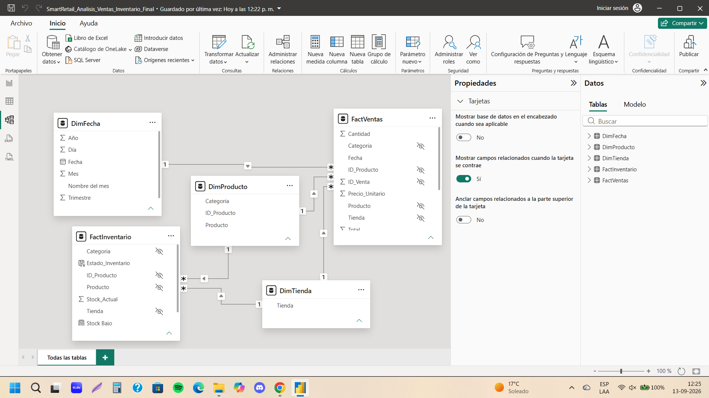
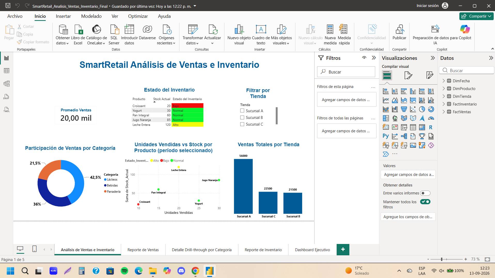
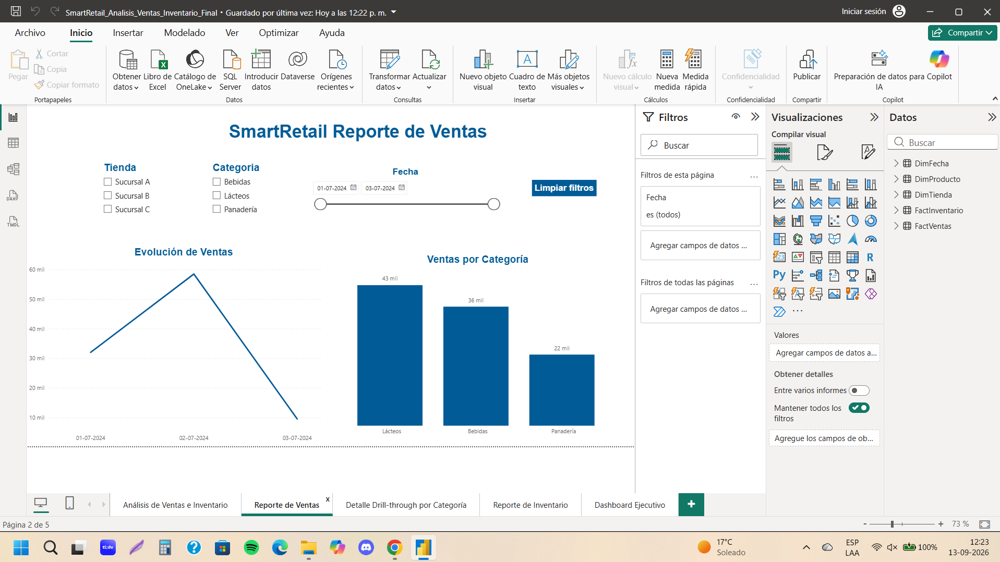
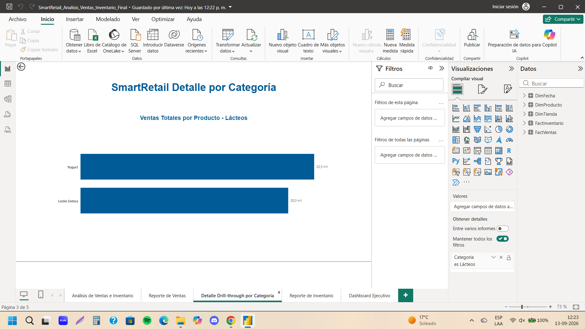
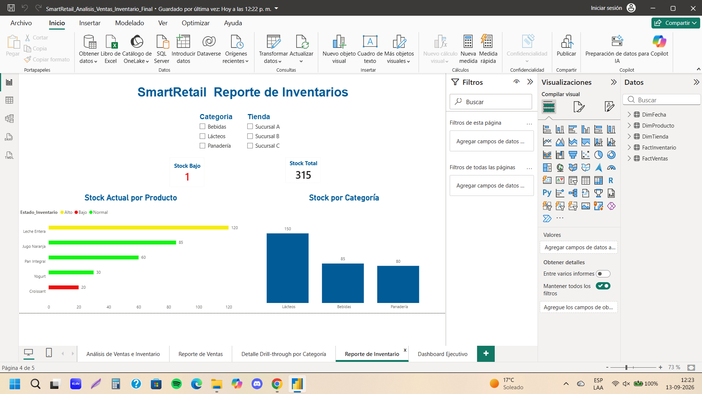
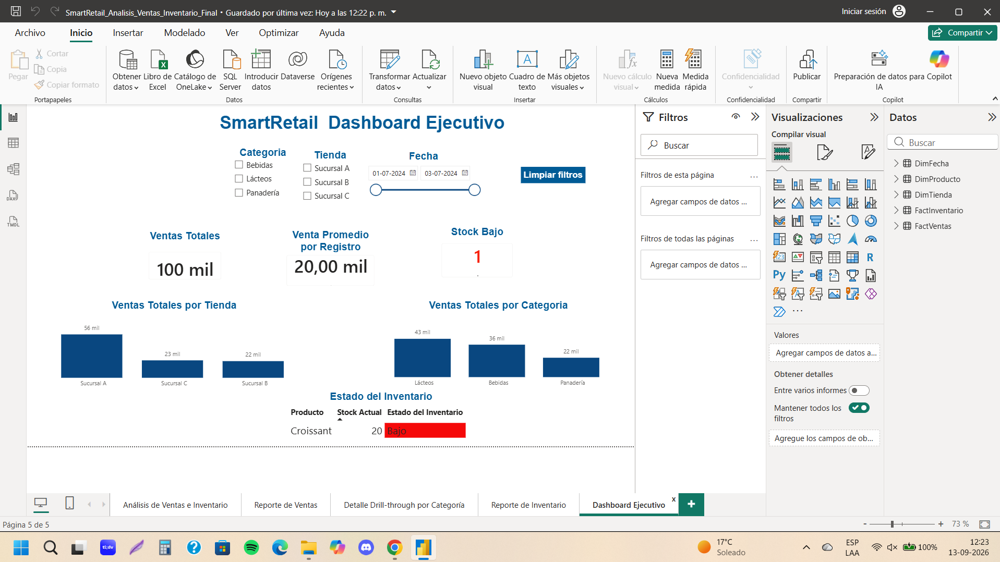

# SmartRetail – Análisis de Ventas e Inventario en Power BI

Proyecto de análisis de ventas e inventario desarrollado en Power BI, orientado a transformar datos operacionales en información útil para la toma de decisiones.

El reporte integra análisis de ventas, stock, desempeño por tienda y categoría, comportamiento por producto e interacción mediante filtros y drill-through.

## Objetivo del proyecto

Construir una solución de análisis que permita:

- monitorear ventas totales y venta promedio;
- analizar participación de ventas por categoría;
- comparar desempeño entre tiendas;
- evaluar niveles de stock por producto y categoría;
- identificar productos con stock bajo, normal o alto;
- relacionar unidades vendidas con stock disponible;
- profundizar desde una categoría hasta el detalle por producto.

## Herramientas utilizadas

- Power BI Desktop
- Power Query
- Modelado dimensional
- DAX
- Visualizaciones interactivas
- Drill-through
- Segmentadores y filtros
- Formato condicional

## Modelo de datos

El modelo utiliza una estructura dimensional con tablas de dimensiones y tablas de hechos.

### Dimensiones

- `DimFecha`
- `DimProducto`
- `DimTienda`

### Tablas de hechos

- `FactVentas`
- `FactInventario`

Las relaciones siguen una estructura uno-a-varios entre las dimensiones y las tablas de hechos.



## Principales medidas DAX

Entre las medidas desarrolladas se encuentran:

- Ventas Totales
- Promedio Ventas
- Participación % Ventas
- Unidades Vendidas
- Stock Bajo
- Stock Total
- Título dinámico para Drill-through

Ejemplo:

```DAX
Unidades Vendidas =
SUM(FactVentas[Cantidad])

Participación % Ventas =
DIVIDE(
    [Ventas Totales],
    CALCULATE(
        [Ventas Totales],
        ALL(DimProducto[Categoria])
    )
)
```


## Páginas del reporte

### 1. Análisis de Ventas e Inventario

Integra ventas, inventario y comportamiento de productos.

Incluye:

promedio de ventas;
estado del inventario;
participación de ventas por categoría;
unidades vendidas vs stock por producto;
ventas totales por tienda;
filtro interactivo por tienda.



### 2. Reporte de Ventas

Permite analizar la evolución temporal y la distribución de ventas.

Incluye:

filtros por tienda;
filtros por categoría;
rango de fechas;
evolución de ventas;
ventas por categoría;
botón para limpiar filtros.



### 3. Detalle Drill-through por Categoría

Permite pasar desde una categoría seleccionada a un detalle de ventas por producto.

El título se actualiza dinámicamente según la categoría seleccionada.



### 4. Reporte de Inventarios

Permite revisar niveles de stock y estado de inventario.

Incluye:

stock actual por producto;
stock por categoría;
indicadores de stock bajo y stock total;
clasificación visual de estado de inventario;
filtros por categoría y tienda.




### 5. Dashboard Ejecutivo

Resume los principales indicadores del negocio.

Incluye:

ventas totales;
venta promedio por registro;
stock bajo;
ventas por tienda;
ventas por categoría;
estado del inventario;
filtros por categoría, tienda y fecha.



## Principales aprendizajes aplicados

Este proyecto permitió aplicar de manera integrada:

limpieza y estructuración de datos;
construcción de un modelo dimensional;
creación de medidas DAX;
uso de dimensiones para segmentación correcta;
análisis conjunto de ventas e inventario;
creación de dashboards operacionales y ejecutivos;
navegación mediante drill-through;
diseño de visualizaciones orientadas a toma de decisiones.

## Archivo Power BI

El archivo final del proyecto se encuentra en:

pbix/SmartRetail_Analisis_Ventas_Inventario_Final.pbix

## Autor

José Mora

Proyecto desarrollado como parte de un portafolio profesional orientado a análisis de datos, operaciones, logística y supply chain.
